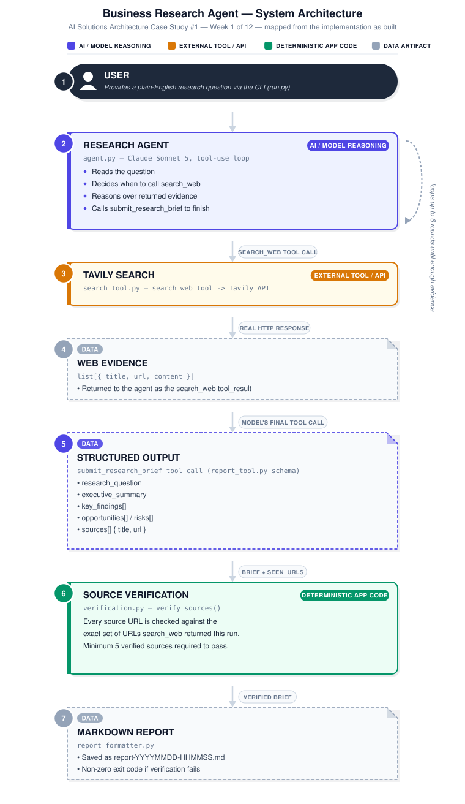

# Week 1 — Business Research Agent

**Program:** 12-Week AI Solutions Architect Mastery
**Role split:** David El Corderu Bey, PhD = Solutions Architect / project owner. Claude = Senior AI Engineer / pair programmer, implementing and teaching the architecture, not deciding it unilaterally.

## What this is

A single Claude agent with two tools:
1. `search_web` (Tavily) — the agent's only way to gather real, current evidence.
2. `submit_research_brief` — a structured "final answer" tool. Forcing the output through a schema instead of free text is what makes source verification a plain data check instead of parsing prose.

The agent researches a business question about a small medical practice (chiropractic offices as the v1 use case) and returns a structured brief: Research Question, Executive Summary, Key Findings, Opportunities, Risks, Sources.

## Architecture

Mapped directly from the implementation — every box below corresponds to a real file and function, not an aspirational design.

## The one non-negotiable architectural decision

**Every cited source is verified against real tool output before the report is trusted.** `verification.py` compares each URL in the model's submitted `sources` list against the actual set of URLs `search_web` returned during that run. Anything that doesn't match is flagged as unverified and excluded from the "verified" count. If fewer than 5 sources verify, the report ships with a loud warning and the program exits non-zero — this was tightened from "ask the model nicely" to "check it in code" specifically because a prompt instruction is a request the model can get wrong; a set-membership check cannot.

## Hard scope boundary

The system prompt (`system_prompt.py`) draws a hard line: business research only (competitors, reputation, market trends), never clinical advice about a patient. This is a prompt-level rule only in v1 — there's no code-level check that a question or answer stayed in scope. That's an open item, not an oversight (see below).

## Files and why each exists

| File | Responsibility |
|---|---|
| `config.py` | The only place that knows where API keys come from. |
| `search_tool.py` | The only file that knows Tavily exists — schema + real HTTP call. |
| `report_tool.py` | The structured "final answer" schema that turns free text into checkable data. |
| `system_prompt.py` | The agent's rules: scope boundary + "only cite real URLs." |
| `agent.py` | The actual agent loop: call Claude, execute any tool it requests, feed results back, stop when it submits a brief. |
| `verification.py` | The deterministic source check — the piece this session's approval process specifically tightened. |
| `report_formatter.py` | Turns the brief + verification result into the final markdown, honestly, including flagging anything unverified. |
| `run.py` | Entry point — wires the above together, contains no decisions of its own. |

## Explicitly NOT built (and why)

- **No database.** Nothing needs to persist across runs yet — each question produces one file.
- **No RAG / vector store.** This researches the live web per question; there's no fixed private corpus to index.
- **No multi-agent orchestration.** One agent making its own tool-use decisions covers every success criterion in the approved scope. Adding a planner/critic/writer split here would be complexity sold to a problem that didn't ask for it.
- **No framework (LangChain, etc.).** Direct API calls keep the actual mechanics visible — that visibility is the point of Week 1.

## Status

**Live validation**

| Check | Result |
|---|---|
| Claude API | Passed |
| Tavily API | Passed |
| Minimum verified sources required | 5 |
| Latest test | 14 cited / 14 verified |
| Exit code | 0 |
| Test question | "What local marketing tactics work best for a new chiropractic office trying to attract its first patients?" |
| Date (UTC) | 2026-09-30 |

Full, unedited output of this run is committed as [`SAMPLE_VERIFIED_RUN.md`](./SAMPLE_VERIFIED_RUN.md) — this is evidence that it worked, not a claim that it should. See `CASE_STUDY.md` for the narrative.

Needs `ANTHROPIC_API_KEY` and `TAVILY_API_KEY` in a `.env` file (see `.env.example`) or as environment variables.

## Evaluation

What's actually been tested versus what's still open — a scope statement, not a passing grade.

| Test | Result |
|---|---|
| Valid research question produces a brief | Pass |
| ≥5 verified sources on a real run | Pass |
| 14/14 source membership verification (cited URL was actually returned by search_web) | Pass |
| Invalid / unreturned URL correctly flagged as unverified | Needs explicit negative test |
| Insufficient verified sources correctly fails with exit code 2 | Needs explicit negative test |
| Clinical-question boundary enforcement | Not code-enforced (prompt-only, see above) |
| Claim/source semantic alignment — does the cited page actually support the claim, not just exist | Not evaluated |

**Source verification ≠ claim verification.** `verify_sources()` proves a cited URL is one `search_web` genuinely returned this run — it does not prove that URL's content actually supports the specific finding attached to it. That second check would require reading the source content and judging semantic support, which is a real (and harder) evaluation problem, not a set-membership check. This is a documented limitation of v1, not a flaw discovered after the fact.

## Open items for Phase 2 (not this week)

- Code-level enforcement of the non-clinical scope boundary (currently prompt-only).
- Persisting/comparing reports across runs (would be the first real justification for a database).
- Handling a vague question with a clarifying follow-up instead of the agent guessing at interpretation.
